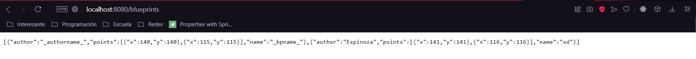
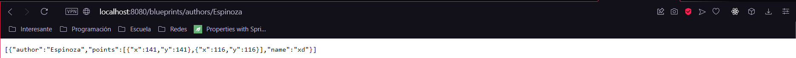
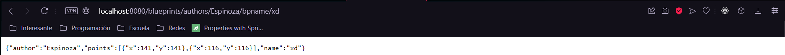

# Lab05ARSW
##Primera Parte 
### Get de todos los blueprints

### Get por autor 

### Get por autor y bpname

##Segunda parte
###Uso de post a los planos

comprobamos que el post funcione con un get desde insomnia

###Tercera parte
**¿Qué condiciones de carrera se podrían presentar?**

Las condiciones que se pueden presentar es que la información cambie mientras se esté accediendo a una consulta, y se obtenga
una consulta antigua.

**¿Cuales son las respectivas regiones críticas?**

El proceso de actualizar deberia de tener prioridad sobre el proceso de consultar.
